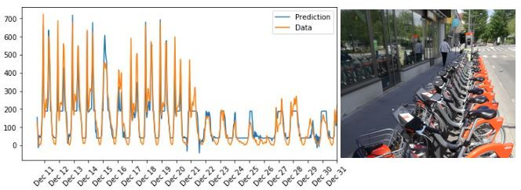

# Bike Rental trends

 
The goal of this project is to create an algorithm to predict the number of bikes needed on a given day. In order to achieve it, a Neural Network is created. 

## Table of Contents 
The following jupyter notebooks are provided:
[1. Data Preparation and model creation](https://github.com/titoniubo/bike_rentals/blob/master/1.%20Data%20preparation%20and%20Model%20Creation.ipynb)
[2. Data Visualizations](https://github.com/titoniubo/bike_rentals/blob/master/2.%20Data%20Visualizations.ipynb)

It is specially interesting to see how data the weather conditions may affect bike rental trends

### Code of ethics

This project has been undertaken complying with a code of [ethics](https://github.com/titoniubo/bike_rentals/blob/master/Code%20of%20ethics.txt) 

### Install
I provide the [environment](https://github.com/titoniubo/bike_rentals/blob/master/environment.yml) used to run this code.

### License
This project is under Copyright © 2019 Josep Maria Niubo. It is free software, and may be redistributed under the terms specified in the [LICENSE](https://github.com/titoniubo/bike_rentals/blob/master/License.txt) file
